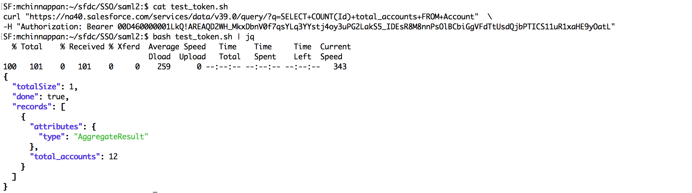

## OAuth 2.0 JWT Bearer Token Flow

JWT: (JSON Web Token) is a JSON-based security token encoding that enables identity and security information to be shared across security domains.


-  Setup the connected app with use-digital-signature option turned on


The certificate corresponds to the private key of the app.


- The developer writes an app that generates a JWT and signs it with the certificate

- The JWT must be signed using RSA SHA256.


- The JWT is posted to the token endpoint https://login|test.salesforce.com/services/oauth2/token

  - The token endpoint validates:
    - the signature using the certificate registered by the developer
      - validates the audience (**aud** = https://login|test.salesforce.com,:), issuer (**iss** = client_id of the connected app), validity (**exp** = expiration time of the assertion within 5 minutes  expressed as the number of seconds from 1970-01-01T0:0:0Z measured in UTC), and subject (**sub** = username of the desired Salesforce user) of the JWT

  - If JWT is valid and that the user or admin authorized the app previously, Salesforce issues an access_token.


### How to create JWT Bearer Token:

- Construct JWT Header:

```json

 {"alg":"RS256"}.

```

- **Base64url encode** the JWT Header

- Construct a JSON **Claims Set** for the JWT with iss, sub, aud, and exp.


```json
{"iss": "3MVG99OxTyEMCQ3gNp2PjkqeZKxnmAiG1xV4oHh9AKL_rSK.BoSVPGZHQ
ukXnVjzRgSuQqGn75NL7yfkQcyy7",
"sub": "my@email.com",
"aud": "https://login.salesforce.com",
"exp": "1333685628"}


```

- **Base64url encode** the JWT **Claims Set** without any line breaks

Example:
```
eyJpc3MiOiAiM01WRzk5T3hUeUVNQ1EzZ05wMlBqa3FlWkt4bm1BaUcxeFY0b0hoOUFLTF9yU0su
Qm9TVlBHWkhRdWtYblZqelJnU3VRcUduNzVOTDd5ZmtRY3l5NyIsICJwcm4iOiAibXlAZW1haWwu
Y29tIiwgImF1ZCI6ICJodHRwczovL2xvZ2luLnNhbGVzZm9yY2UuY29tIiwgImV4cCI6ICIxMzMz
Njg1NjI4In0=

```


- Create a string for the **encoded JWT Header** and the **encoded JWT Claims Set** in this format:

```

JWT_str = encoded_JWT_Header + "." + encoded_JWT_Claims_Set

```
Example: JWT_str:


**eyJhbGciOiJSUzI1NiJ9**.*eyJpc3MiOiAiM01WRzk5T3hUeUVNQ1EzZ05wMlBqa3FlWkt4bm1BaUcxeFY0b0hoOUFLTF9yU0su
Qm9TVlBHWkhRdWtYblZqelJnU3VRcUduNzVOTDd5ZmtRY3l5NyIsICJwcm4iOiAibXlAZW1haWwu
Y29tIiwgImF1ZCI6ICJodHRwczovL2xvZ2luLnNhbGVzZm9yY2UuY29tIiwgImV4cCI6ICIxMzMz
Njg1NjI4In0=*


- SIGN the **JWT_str** using SHA256 with RSA

```
  base64_encoded_signature = sign(JWT_str)

  JWT_token = JWT_str + "." +   base64_encoded_signature

```

Example:

**eyJhbGciOiJSUzI1NiJ9.eyJpc3MiOiAiM01WRzk5T3hUeUVNQ1EzZ05wMlBqa3FlWkt4bm1BaUcxeFY0b0hoOUFLTF9yU0su
Qm9TVlBHWkhRdWtYblZqelJnU3VRcUduNzVOTDd5ZmtRY3l5NyIsICJwcm4iOiAibXlAZW1haWwu
Y29tIiwgImF1ZCI6ICJodHRwczovL2xvZ2luLnNhbGVzZm9yY2UuY29tIiwgImV4cCI6ICIxMzMz
Njg1NjI4In0=**.*iYCthqWCQucwi35yFs-nWNgpF5NA_a46fXDTNIY8ACko6BaEtQ9E6h4Hn1l_pcwcK​
I_GlmfUO2dJDg1A610t09TeoPagJsZDm_H83bsoZUoI8LpAA1s-2aj_Wbysqb1j4uDToz​
480WtEbkwIv09sIeS_-QuWak2RXOl1Krnf72mpVGS4WWSULodgNzlKHHyjAMAHiBHIDNt​
36y2L2Bh7M8TNWiKa_BNM6s1FNKDAwHEWQrNtAeReXgRy0MZgQY2rZtqT2FcDyjY3JVQb​
En_CSjH2WV7ZlUwsKHqGfI7hzeEvVdfOjH9NuaJozxvhPF489IgW6cntPuT2V647JWi7ng*


### JWT Debugger:

https://jwt.io/#debugger-io

---------------


[Refer the java code that generates JWT Token](./java/JWTTokenGen.java)


Results:



## References
1. [doc: OAuth 2.0 JWT Bearer Token Flow Flow](https://help.salesforce.com/articleView?id=remoteaccess_oauth_web_server_flow.htm&language=en&type=0)

2. [Obtaining an Access Token using a JWT Bearer Token](https://developer.salesforce.com/page/Digging_Deeper_into_OAuth_2.0_on_Force.com#Obtaining_an_Access_Token_using_a_JWT_Bearer_Token)
