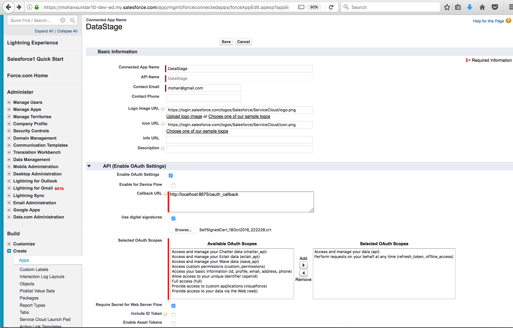

## Notes on setting up Salesforce OAuth 2.0 SAML Bearer Assertion Flow


### Steps:


**Key idea**:

The OAuth 2.0 SAML bearer assertion flow defines:

   How a SAML assertion can be used to request an OAuth access token when:  a client wants to use a previous authorization

  Authentication of the authorized app is provided by the **digital signature applied to the SAML assertion**.


---------


### OAuth 2.0 SAML Bearer Assertion Flow:


The OAuth 2.0 SAML bearer assertion flow is similar to a refresh token flow within OAuth.

The SAML assertion is posted to the OAuth token endpoint (https://test.salesforce.com/services/oauth2/token),
which in turn processes the assertion and issues an **access_token** based on prior approval of the app.


 - the Assertion is POSTed (1) to the OAuth token endpoint, https://login.salesforce.com/services/oauth2/token, with payload of the form:

```
  grant_type	Set this to urn:ietf:params:oauth:grant-type:saml2-bearer
  assertion	The SAML Bearer Assertion, encoded using **base64url**

  example:
  grant_type=urn%3Aietf%3Aparams%3Aoauth%3Agrant-type%3Asaml2-bearer&assertion=PHN...QZT

```
- The authorization server validates the Assertion and issues an access_token (2) based upon prior approval of the application.


However, the client isn’t required to have or store a refresh_token, nor is a client_secret required to be passed to the token endpoint.


----------

### Steps involved
These are the general steps involved in using the OAuth 2.0 SAML bearer assertion flow.

The OAuth 2.0 SAML Bearer Assertion Flow utilizes an X509 Certificate.

The developer creates a connected app and registers an X509 Certificate.
This certificate corresponds to the private key of the app. When the connected app is saved,
 a consumer key (OAuth client_id) is generated and assigned to the app.

 (ref: https://developer.salesforce.com/blogs/isv/2015/04/integrating-multi-orgs-using-oauth.html)
1. Navigate to App Setup > Create > Apps > **Connected Apps** > New

2. Complete the required fields in the Basic Information Section:

  - Connected App Name

  - API Name

  - Contact Email
  

3. In the API (Enable OAuth Settings) Section click the Enable OAuth Settings checkbox.

4. Enter the Callback URL

5. For Selected OAuth Scopes, add Perform requests on your behalf at any time (refresh_token), and add other OAuth scopes, as required.  It is required to add at least one additional OAuth scope.

6. Click the Use digital signatures checkbox,
   click the Choose File button and select the Certificate file that was created above (e.g. mycert.cer)

7. Click the *Save* button.


The certificate corresponds to the private key of the remote access application to be developed.

An example of how to create a certificate:
```
keytool -keysize 2048 -genkey -alias mycert -keyalg RSA -keystore ./mycert.jks
keytool -importkeystore -srckeystore mycert.jks -destkeystore mycert.p12 -deststoretype PKCS12
openssl pkcs12 -in mycert.p12 -out key.pem -nocerts –nodes
keytool -export -alias mycert -file mycert.crt -keystore mycert.jks -rfc
```


- The developer writes **an app** that **generates a SAML assertion and signs it with the private key** of the above certificate.

- The SAML Bearer assertion is posted to the token endpoint https://login.salesforce.com/services/oauth2/token

- The token endpoint (https://login.salesforce.com/services/oauth2/token) validates the signature using
 the certificate registered by the developer.

- The token endpoint validates the audience, issuer, subject, and validity of the assertion.
Assuming that the assertion is valid and that the user or admin authorized the app previously, Salesforce issues an access token.


**Note**:

A *refresh_token* is never issued in this flow.

------
### SAML bearer assertion

1. The developer must create a valid SAML bearer assertion that conforms to the following rules.

2. The Issuer must be the OAuth client_id or the connected app for which the developer registered their certificate.

3. The Audience must be https://login.salesforce.com or https://test.salesforce.com.

4. The Recipient must be https://login.salesforce.com/services/oauth2/token or https://test.salesforce.com/services/oauth2/token.

5. The Subject NameID must be the username of the desired Salesforce user.

6. The assertion must be signed according to the XML Signature specification, using RSA and either SHA-1 or SHA-256.

7. The SAML assertion must conform with the general format rules specified here: http://tools.ietf.org/html/draft-ietf-oauth-saml2-bearer.

8. When posted to the token endpoint, the assertion must be encoded using base64url encoding as defined here: http://tools.ietf.org/html/rfc4648#page-7


### Sample SAML Assertion

```XML

<saml:Assertion xmlns:saml="urn:oasis:names:tc:SAML:2.0:assertion" ID="_cd3649b3639560458bc9d9b33dfee8d21378409114655" IssueInstant="2013-09-05T19:25:14.654Z" Version="2.0">
    <!-- 2. The Issuer must be the OAuth client_id or the connected app for which the developer registered their certificate. -->
    <saml:Issuer Format="urn:oasis:names:tc:SAML:2.0:nameid-format:entity" xmlns:saml="urn:oasis:names:tc:SAML:2.0:assertion">
        3MVG9PhR6g6B7ps45QoRvhVGGMmR_DT4kxXzVXOo6TTHF3QO1nmqOAstC92.4qSUiUeEDcuGV4tmAxyo_fV8j
    </saml:Issuer>

    <ds:Signature xmlns:ds="http://www.w3.org/2000/09/xmldsig#">
       <!-- The assertion must be signed according to the XML Signature specification, using RSA and either SHA-1 or SHA-256. -->

        <ds:SignedInfo>
            <ds:CanonicalizationMethod Algorithm="http://www.w3.org/2001/10/xml-exc-c14n#"/>
            <ds:SignatureMethod Algorithm="http://www.w3.org/2001/04/xmldsig-more#rsa-sha256"/>
            <ds:Reference URI="#_cd3649b3639560458bc9d9b33dfee8d21378409114655">
                <ds:Transforms>
                    <ds:Transform Algorithm="http://www.w3.org/2000/09/xmldsig#enveloped-signature"/>
                    <ds:Transform Algorithm="http://www.w3.org/2001/10/xml-exc-c14n#"><ec:InclusiveNamespaces xmlns:ec="http://www.w3.org/2001/10/xml-exc-c14n#" PrefixList="ds saml"/>
                    </ds:Transform>
                </ds:Transforms>
                <ds:DigestMethod Algorithm="http://www.w3.org/2000/09/xmldsig#sha1"/>
                <ds:DigestValue>N8DxylbIeNg8JDO87WIqXGkoIWA=</ds:DigestValue>
            </ds:Reference>
        </ds:SignedInfo>

        <ds:SignatureValue>
            XV0lFJrkhJykGYQbIs0JBFEHdt4pe2gBgitcXrscNVX2hKGpwQ+WqjF8EKrqV4Q3/Q4KglrXl/6s xJr6WOmxWtIQC4oWhSvVyfag34zQoecZeunEdFSMlnvPtqBVzJu9hJjy/QDqDWfMeWvF9S50Azd0 EhJxz/Ly1i28o4aCXQQ=
        </ds:SignatureValue>

        <ds:KeyInfo>
            <ds:X509Data>
                <ds:X509Certificate>
MIICOzCCAaSgAwIBAgIGAR7RRteKMA0GCSqGSIb3DQEBBQUAMGExCzAJBgNVBAYTAlVTMQswCQYD
VQQIEwJDQTEWMBQGA1UEBxMNU2FuIEZyYW5jaXNjbzENMAsGA1UEChMEUEFDUzENMAsGA1UECxME
U0ZEQzEPMA0GA1UEAxMGU0FNTDIwMB4XDTA5MDExMzE4MzUyN1oXDTE0MDExMTE4MzUyN1owYTEL
MAkGA1UEBhMCVVMxCzAJBgNVBAgTAkNBMRYwFAYDVQQHEw1TYW4gRnJhbmNpc2NvMQ0wCwYDVQQK
EwRQQUNTMQ0wCwYDVQQLEwRTRkRDMQ8wDQYDVQQDEwZTQU1MMjAwgZ8wDQYJKoZIhvcNAQEBBQAD
gY0AMIGJAoGBAJNGcu8nW6xq2l/dAgbJmSfHLGRn+vCuKWY+LAELw+Kerjaj5Dq3ZGW38HR4BmZk
sG3g4eA1RXn1hiZGI1Q6Ei59QE/OZQx2zVSTb7+oIwRcDHEB1+RraYT3LJuh4JwUDVfEj3WgDnTj
E5vD46l/CR5EXf4VL8uo8T40FkA51AhTAgMBAAEwDQYJKoZIhvcNAQEFBQADgYEAehxggY6tBl8x
1SSvCUyUIHvxssAn1AutgZLKWuR1+FXfJzdVdE2F77nrV9YifIERUwhONiS82mBOkKqZZPL1hcKh
KSnFZN2iWmm1sspL73I/eAwVsOUj+bS3v9POo4ceAD/QCCY8gUAInTH0Mq1eOdJMhYKnw/blUyqj
Zn9rajY=
                </ds:X509Certificate>
            </ds:X509Data>
        </ds:KeyInfo>
    </ds:Signature>

    <saml:Subject xmlns:saml="urn:oasis:names:tc:SAML:2.0:assertion">

        <!-- The Subject NameID must be the username of the desired Salesforce user. -->
        <saml:NameID Format="urn:oasis:names:tc:SAML:1.1:nameid-format:unspecified" xmlns:saml="urn:oasis:names:tc:SAML:2.0:assertion">
            username_of_sfdc_user@example.com
        </saml:NameID>

        <saml:SubjectConfirmation Method="urn:oasis:names:tc:SAML:2.0:cm:bearer" xmlns:saml="urn:oasis:names:tc:SAML:2.0:assertion">
            <!-- The Recipient must be https://login.salesforce.com/services/oauth2/token or https://test.salesforce.com/services/oauth2/token. -->
            <saml:SubjectConfirmationData NotOnOrAfter="2013-09-05T19:30:14.654Z" Recipient="https://login.salesforce.com/services/oauth2/token"/>
        </saml:SubjectConfirmation>

    </saml:Subject>

    <saml:Conditions NotBefore="2013-09-05T19:25:14.654Z"
                  NotOnOrAfter="2013-09-05T19:30:14.654Z"
                xmlns:saml="urn:oasis:names:tc:SAML:2.0:assertion">

        <saml:AudienceRestriction xmlns:saml="urn:oasis:names:tc:SAML:2.0:assertion">
            <!--  The Audience must be https://login.salesforce.com or https://test.salesforce.com. -->
            <saml:Audience>https://login.salesforce.com/services/oauth2/token</saml:Audience>
        </saml:AudienceRestriction>

    </saml:Conditions>

    <saml:AuthnStatement AuthnInstant="2013-09-05T19:25:14.655Z" xmlns:saml="urn:oasis:names:tc:SAML:2.0:assertion">
        <saml:AuthnContext xmlns:saml="urn:oasis:names:tc:SAML:2.0:assertion">
            <saml:AuthnContextClassRef>urn:oasis:names:tc:SAML:2.0:ac:classes:unspecified</saml:AuthnContextClassRef>
        </saml:AuthnContext>
    </saml:AuthnStatement>

</saml:Assertion>

```


### Setting up Connected App to use digital signature


## References
1. [doc: OAuth 2.0 SAML Bearer Assertion Flow](https://help.salesforce.com/articleView?id=remoteaccess_oauth_SAML_bearer_flow.htm&language=en&type=0)

2. [Obtaining an Access Token using a SAML Bearer Assertion](https://developer.salesforce.com/page/Digging_Deeper_into_OAuth_2.0_on_Force.com#Obtaining_an_Access_Token_using_a_SAML_Bearer_Assertion)
