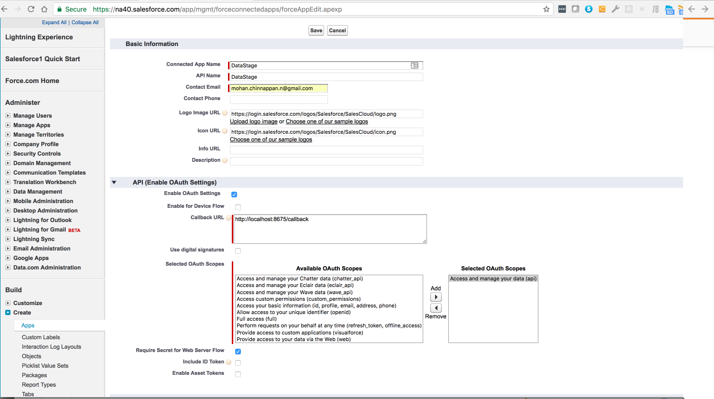
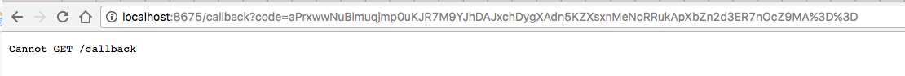
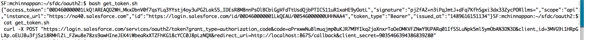
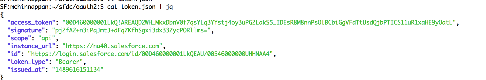

## Web Server Flow


-  Setup the connected app




-  GET :

```
https://login|test.salesforce.com/services/oauth2/authorize?response_type=code&client_id=<your_client_id>&redirect_uri=<your_redirect_uri>
```

Example:
```
https://login.salesforce.com/services/oauth2/authorize?response_type=code&client_id=3MVG9i1HRpGLXp.oEUJBu3fjSz18RMHlZi_FZwu8e78zs9awHIneJEK4iWbeaRxXTZFhKG18cYCC0J8pLzNQX&redirect_uri=http://localhost:8675/callback

```

You will get the **code** (Verification Code) as shown below:



- Exchange Verification Code for Access Token

 POST : the code (Verification Code) to get the access_token:

```
https://login.salesforce.com/services/oauth2/token?grant_type=authorization_code&client_id=<your_client_id>&client_secret=<your_client_secret>&redirect_uri=<your_redirect_uri>&code<code_got_in_last_step>

```

Example:

```
curl -X POST "https://login.salesforce.com/services/oauth2/token?grant_type=authorization_code&code=aPrxwwNuBlmuqjmp0uKJR7M9YIkq2jaXnxrTaOeDMKVFZNwY9UPARq01IfSSLuNpk5ml5ymObA%3D%3D&client_id=3MVG9i1HRpGLXp.oEUJBu3fjSz18RMHlZi_FZwu8e78zs9awHIneJEK4iWbeaRxXTZFhKG18cYCC0J8pLzNQX&redirect_uri=http://localhost:8675/callback&client_secret=9035466394386839280"


```

Response:Salesforce Responds with an Access Token Response






### Using the Access token:

```
curl -X POST "https://login.salesforce.com/services/oauth2/token?grant_type=authorization_code&code=aPrxwwNuBlmuqjmp0uKJR7M9YIkq2jaXnxrTaOeDMKVFZNwY9UPARq01IfSSLuNpk5ml5ymObA%3D%3D&client_id=3MVG9i1HRpGLXp.oEUJBu3fjSz18RMHlZi_FZwu8e78zs9awHIneJEK4iWbeaRxXTZFhKG18cYCC0J8pLzNQX&redirect_uri=http://localhost:8675/callback&client_secret=9035466394386839280"


```

Results:


## References
1. [doc: OAuth 2.0 SAML Bearer Assertion Flow](https://help.salesforce.com/articleView?id=remoteaccess_oauth_web_server_flow.htm&language=en&type=0)

2. [Obtaining an Access Token using a SAML Bearer Assertion](https://developer.salesforce.com/page/Digging_Deeper_into_OAuth_2.0_on_Force.com#Obtaining_an_Access_Token_in_a_Web_Application_.28Web_Server_Flow.29)
